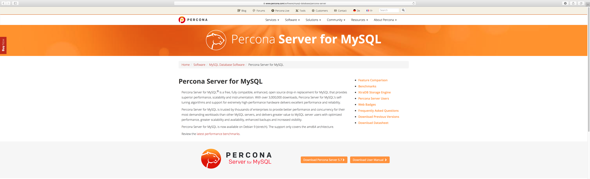
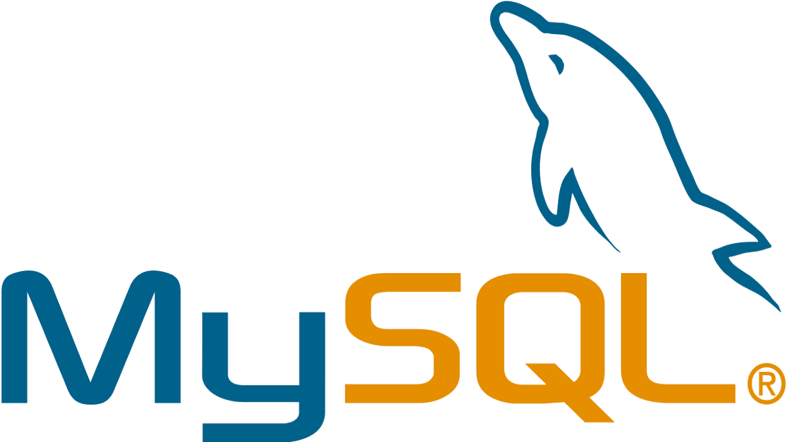
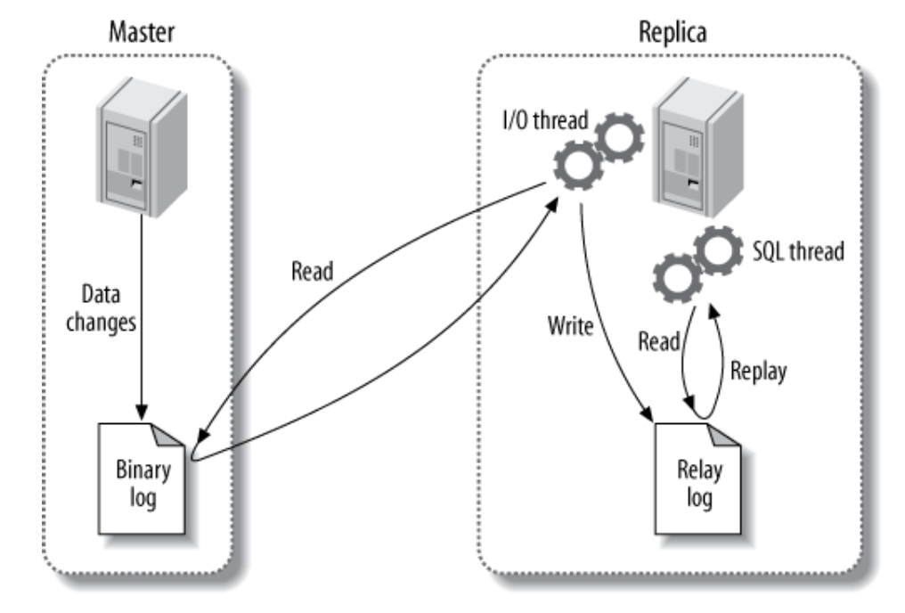

#HSLIDE

## Docker container for <span style="color:#e49436">MySQL</span> Master/Slave
#### Without the Frustration 
(Thanks to <span style="color:#e49436">Ansible</span>)

#VSLIDE?image=assets/images/cali.jpg

### <span style="color:#ede8e7; background-color:#0e2a35BF">Daniel Guzman Burgos</span> 
##### <span style="color:#ede8e7; background-color:#0e2a35BF">electronic engineer</span> 
##### <span style="color:#ede8e7; background-color:#0e2a35BF">Tech Lead MySQL at Percona in Cali, Colombia</span> 
##### <span style="color:#ede8e7; background-color:#0e2a35BF">Managed services POD Team</span> 

#VSLIDE

## What is Percona?

- The only company that delivers enterprise-class support, consulting, managed services and software <!-- .element: class="fragment" data-fragment-index="1" -->
- MySQL® <!-- .element: class="fragment" data-fragment-index="2" -->
- MariaDB® <!-- .element: class="fragment" data-fragment-index="2" -->
- MongoDB® <!-- .element: class="fragment" data-fragment-index="2" -->
- And other open source databases across on-premise and cloud-based platforms. <!-- .element: class="fragment" -->
- 3000 clients worldwide / Employs a global network of experts with a staff of over 140 people <!-- .element: class="fragment" -->

#HSLIDE

# Percona Server and MySQL

#VSLIDE

## What is Percona Server?

Percona Server for MySQL® is a free, fully compatible, enhanced, open source drop-in replacement for MySQL 

<p style="max-width: 70%; margin: 0 auto;">

</p>

#VSLIDE

## What is MySQL?

- Is an open-source relational database management system (RDBMS) <!-- .element: class="fragment" data-fragment-index="1" -->
- With a lot of features<!-- .element: class="fragment" data-fragment-index="2" -->
- Being the replication the feature that we need to put focus today. <!-- .element: class="fragment" -->

<p style="width: 30%; height:30%; margin: 0 auto;">

</p>

#VSLIDE

```bash
mysql> show slave status\G
*************************** 1. row ***************************
               Slave_IO_State: Waiting for master to send event
                  Master_Host: mysql1
```

<p style="max-width: 70%; margin: 0 auto;">

</p>
<!--
MySQL’s built-in replication is the foundation for building large, high-performance applications on top of MySQL, using the so-called “scale-out” architecture. Replication lets you configure one or more servers as replicas1 of another server, keeping their data synchronized with the master copy. This is not just useful for high-performance applications—it is also the cornerstone of many strategies for high availability, scala- bility, disaster recovery, backups, analysis, data warehousing, and many other tasks. In fact, scalability and high availability are related topics.
-->

#HSLIDE

# Docker

#VSLIDE

## Docker because is light

#HSLIDE

# Ansible

#VSLIDE

## Ansible because i'm lazy

<!--
Design requires decision-making. Especially when it comes to things that on the surface appear purely aesthetic (like an API), everyone will have input.
In some technical areas, it can be quite valuable to have a decision maker whose head is in the game and can make a final call and move on.
Even better, outsource your decisions if possible.
-->


#HSLIDE

# Hands on!

#VSLIDE

## Get the code!
https://github.com/nethalo/ansible-mysql-docker

#HSLIDE

# Appendix

#VSLIDE

## WE ARE HIRING!!

https://www.percona.com/careers
